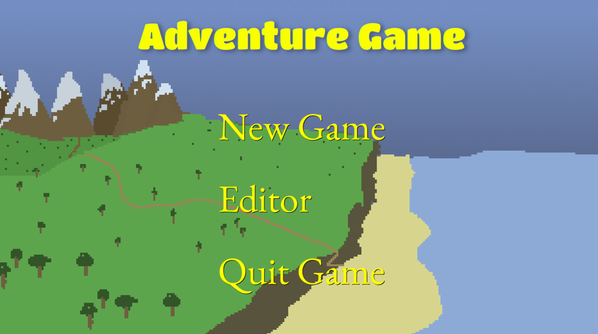

# AI Agent's Adventure Game 🎮

An interactive 2D adventure game featuring NPCs powered by custom AI agents. The game has been developed with Python, PyGame, and LangChain.



## ✨ Features

### 🤖 AI Systems
- **Autonomous NPC Agents**: NPCs with individual personalities and decision-making capabilities
- **Dynamic Conversations**: Natural language processing for realistic NPC interactions


## 🚀 Getting Started

### Installation

1. **Clone the repository**
   ```bash
   git clone https://github.com/yourusername/ai-agents-adventure-game.git
   cd ai-agents-adventure-game
   ```

2. **Create a virtual environment**
   
   Windows:
   ```bash
   python -m venv venv
   venv\Scripts\activate
   ```

   MacOS/Linux:
   ```bash
   python3 -m venv venv
   source venv/bin/activate
   ```

3. **Install dependencies**
   ```bash
   pip install -r requirements.txt
   ```

4. **Start the game**
   ```bash
   python src/main.py
   ```

## 🗺️ Project Structure
```
adventure_game_python_ai_agent/
├── components/         # Game components and AI systems
├── content/           # Game assets and resources
├── docs/             # Documentation
└── src/              # Source code
```


## 🎮 How to Play

### Basic Controls
- **W** - Move Up
- **A** - Move Left
- **S** - Move Down
- **D** - Move Right
- **Mouse Click** - Attack with weapon/Start NPC dialogue


### Getting Started in the Game
1. Move around using W,A,S,D keys
2. Find and pick up the sword by walking over it in the forest
3. Use the sword on enemies by mouse clicks to defeat them.

### Interacting with NPCs
1. Go near the characters and click on them to start dialogue  
1.1. Nancy – Sells diamonds  
1.2. Albert – Sells axes  
1.3. Bob – Uses web browsing to answer query  
1.4. Amy – Teaches physics as a mad person  
2. To end dialogue, type "Bye".
